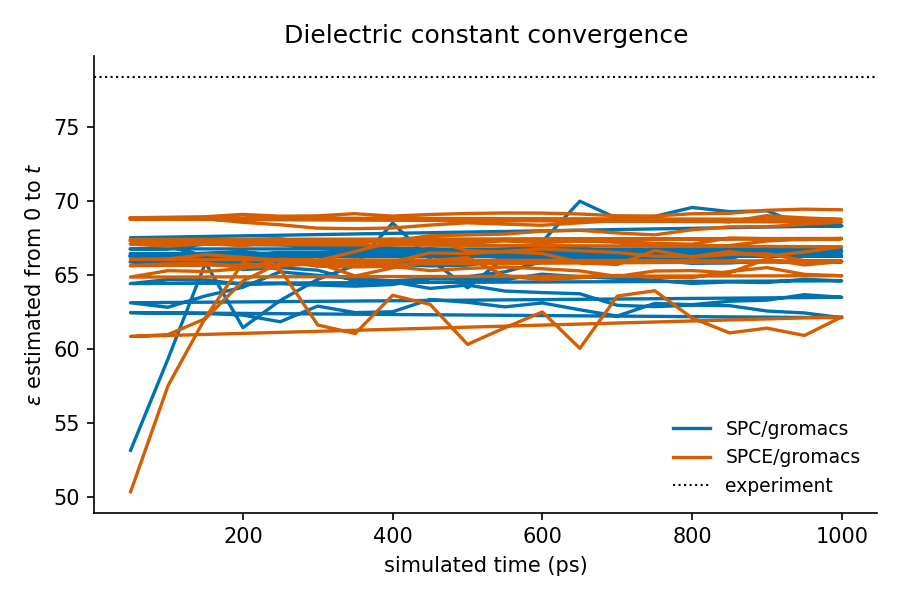
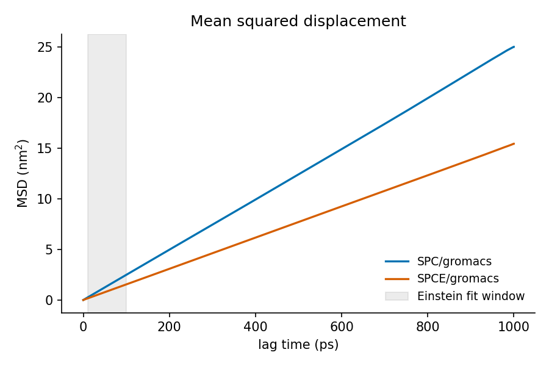
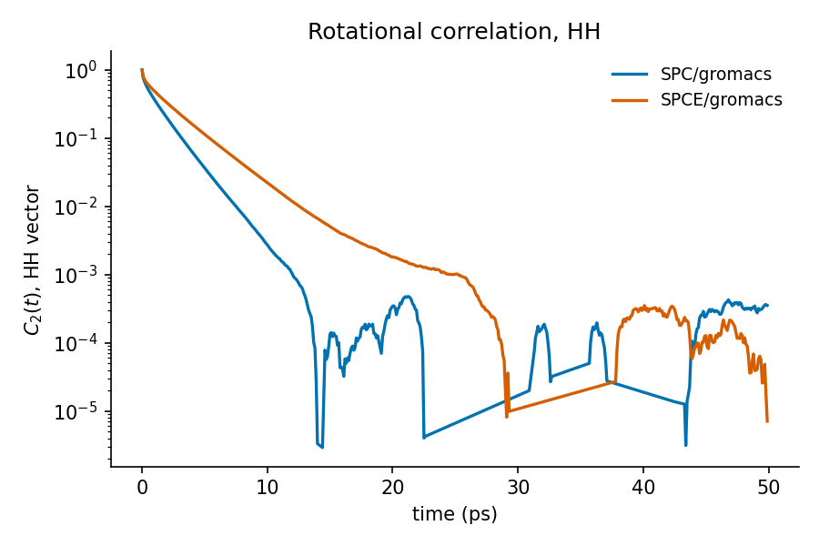
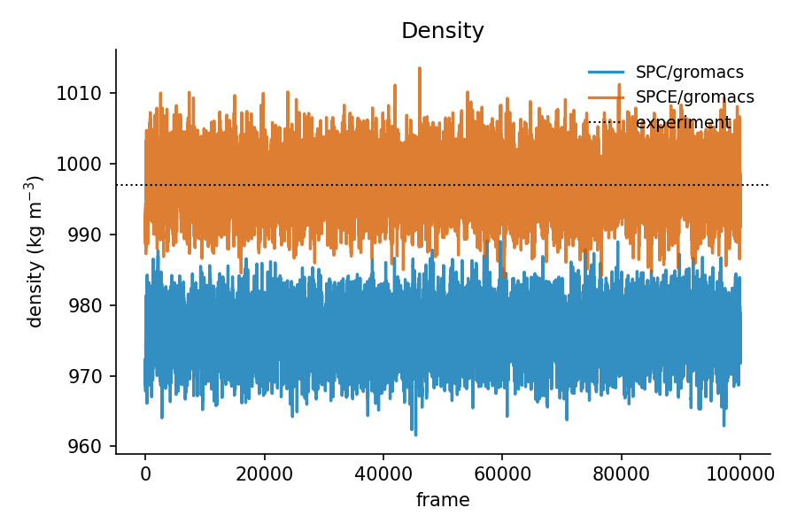

# Water model benchmark

2048 water molecules, 298.15 K, 1 atm, 10 x 1 ns production.
Single-range cutoff 1.8 nm, reaction field eps_rf = 61, timestep 1 fs.

## Results

| Property                                 | Unit          | SPC/gromacs     | SPCE/gromacs     | Experiment | Source                                                    |
|------------------------------------------|---------------|-----------------|------------------|------------|-----------------------------------------------------------|
| Density                                  | kg m^-3       | 976.0 +/- 0.078 | 997.4 +/- 0.069  | 997.0      | Kell 1975, J. Chem. Eng. Data 20:97                       |
| dH_vap                                   | kJ mol^-1     | 44.19 +/- 0.001 | 49.27 +/- 0.0014 | 43.99      | Wagner & Pruss 2002, IAPWS-95                             |
| Self-diffusion D                         | 1e-9 m^2 s^-1 | 4.32 +/- 0.005  | 2.73 +/- 0.0028  | 2.30       | Holz et al. 2000, PCCP 2:4740                             |
| Rot. corr. time tau2(HH)                 | ps            | 1.17            | 1.99             | 2.00       | NMR relaxation; Ludwig 2001, Angew. Chem. 40:1808         |
| Rot. corr. time tau1(mu)                 | ps            | 2.82            | 4.65             | 8.30       | Debye tau_D (collective); Ronne et al. 1997, JCP 107:5319 |
| Dielectric constant (eps = 1 + y)        | -             | 66.3 +/- 1.7    | 69.4 +/- 1.5     | 78.4       | Fernandez et al. 1997, J. Phys. Chem. Ref. Data 26:1125   |
|   dipole fluctuation y                   | -             | 65.3            | 68.4             | -          | -                                                         |
|   eps by Neumann(eps_rf = 61) [unstable] | -             | 140             | 155              | -          | -                                                         |

## Deviation from experiment

`[!]` marks a value outside the published range for that model, which points
at the setup rather than at the model -- unless a note below says otherwise.
tau1(mu) is omitted: the experimental Debye time is a collective quantity and
not directly comparable to the single-molecule correlation time simulated.

| Property                          | SPC/gromacs | SPCE/gromacs |
|-----------------------------------|-------------|--------------|
| Density                           | -2.1%       | +0.0%        |
| dH_vap                            | +0.5%  [!]  | +12.0%       |
| Self-diffusion D                  | +87.8%      | +18.8%       |
| Rot. corr. time tau2(HH)          | -41.4%      | -0.4%        |
| Dielectric constant (eps = 1 + y) | -15.5%      | -11.5%       |

- SPC/gromacs, hov: published SPC dH_vap (41-44) is mostly at ~0.9 nm cutoffs; the 1.8 nm cutoff here recovers more attractive energy, so a value at the top of the range is the protocol, not an error

## Figures

